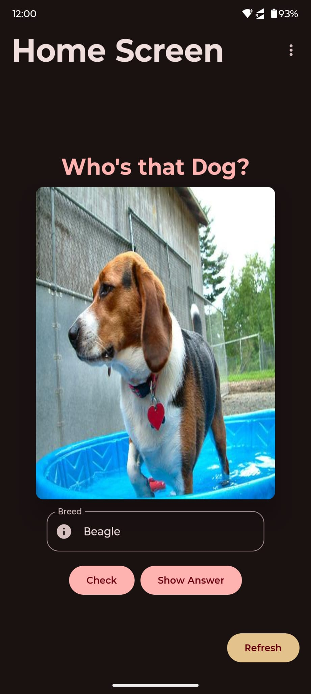

# WhosThatDog

## Overview
This is a **Jetpack Compose** Android application built with Kotlin that fetches and displays a list of items from [this API](https://dog.ceo/dog-api/).

## Features
- **Data Fetching**: Retrieves JSON data from the API.
- **Modern UI with Jetpack Compose**:
   - Utilizes **LazyColumn** for efficient list rendering.
   - Smooth UI experience with **Material Design components**.
- **Additional Enhancements**:
   - **Custom Launcher Icon**: Gives the app a polished look.

- **Splash Screen**: A startup screen before navigating to the main content.
- **Custom Launcher Icon**: A unique app icon for branding.
- **Jetpack Compose UI**: Fully built using the latest **Compose UI**.
- **Networking with Retrofit**: Fetches and processes data asynchronously.
- **MVVM Architecture**: Ensures separation of concerns and better maintainability.
- **Coroutines & Flow**: For efficient background operations.
- **Material 3 Design**: Provides a sleek and modern UI.

---

## Screenshots
| Home Screen                                  | Breeds List                                  | Images of the Breed                              |
|----------------------------------------------|----------------------------------------------|--------------------------------------------------|
|         |  |        |

---

## Tech Stack
- **Language**: Kotlin
- **UI Framework**: Jetpack Compose
- **Architecture**: MVVM (Model-View-ViewModel)
- **Networking**: Retrofit + Gson
- **State Management**: `remember`, `StateFlow`
- **Asynchronous Processing**: Coroutines + Flow
- **Material 3**: Latest Material UI components

---

### Prerequisites:
- **Minimum SDK**: 24
- **Compile SDK**: 35

### Steps:
1. **Clone the repository**
   ```sh
   git clone https://github.com/vishnu32510/WhosThatDog.git
